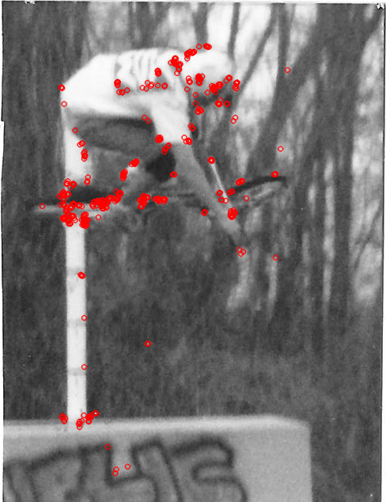
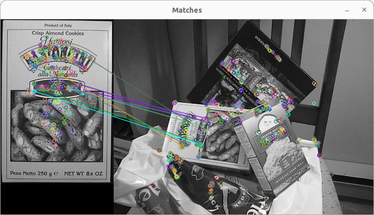

# Feature Detection Example

## Prerequisites

- **libclang-dev**
  - sudo apt install libclang-dev
- **libstdc++-12-dev**
  - sudo apt install libstdc++-12-dev
- **OpenCV v4.6.0**
  - ``` git clone  https://github.com/opencv/opencv.git  --branch 4.6.0 --depth 1 ```
  - ``` cmake -B target/ -S . ```
  - ``` cd target/ && make -j`nproc` ```
  - ``` sudo make install ```

## Orb example

```bash
./featuredetect img/sjb-aerial.png
```





## Going Forward:

GTSAM itself does not provide direct functionality for generating point clouds from a series of images. GTSAM is focused on optimization and estimation tasks in robotics and computer vision, such as SLAM, sensor fusion, and nonlinear optimization.

However, you can use GTSAM in conjunction with other libraries and tools to achieve this goal. One common approach is to use a structure-from-motion (SfM) pipeline that combines feature extraction, matching, camera pose estimation, and point cloud reconstruction. Here's a simplified outline of how you might use various tools, including GTSAM, for this purpose:

1. Feature Extraction and Matching:
Use a library like OpenCV to extract keypoints and descriptors from your images. Then, match the keypoints across images to establish correspondences.

2. Camera Pose Estimation:
Use GTSAM to estimate the relative poses (transformations) between camera frames. GTSAM can help optimize these poses while considering noise and uncertainties.

3. Bundle Adjustment:
After estimating camera poses, perform bundle adjustment using GTSAM. Bundle adjustment refines the estimated poses and 3D points by minimizing the reprojection error, which is the difference between the projected 3D points and the observed 2D keypoints in the images.

4. Point Cloud Generation:
Once the bundle adjustment is complete, you can extract the 3D coordinates of the triangulated points (landmarks) from the optimization results. These 3D points collectively form your 3D point cloud.

5. Visualization:
Use a 3D visualization library like PCL (Point Cloud Library) or OpenGL to visualize the generated point cloud.

It's important to note that implementing a complete structure-from-motion pipeline involves multiple steps, and you may need to work with other libraries and tools in addition to GTSAM. Also, the field of computer vision and SLAM is rapidly evolving, so it's a good idea to search for more recent resources and examples to ensure you're using the most up-to-date techniques and libraries.

For up-to-date examples and tutorials, consider searching for resources on GitHub, research papers, online forums, and websites of academic institutions that focus on computer vision and robotics.